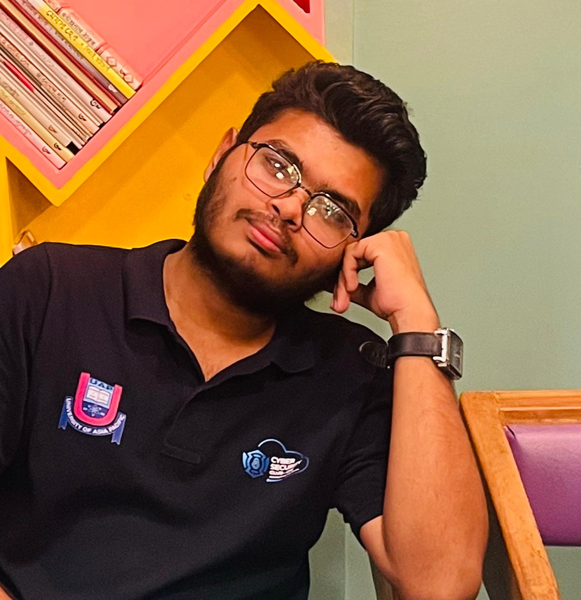

  

# About Me

I’m **Md Hamidur Rahman**, an 18-year-old **Technology Innovation Lead** at **Chintachokro** and a **Rover** at the **Munshigonj Polytechnic Institute Rover Scout Group**. I also serve as an **Executive Member** of the **MUPI Computer Club**.

I am a student with a strong interest in **cybersecurity**, particularly in **web security** and **penetration testing**. I love to develop **applications and websites**, focusing on enhancing functionality and security.  

In addition to my passion for security, I am also deeply involved in **UI/UX design**, where I specialize in creating **user-centered interfaces** and crafting intuitive, engaging experiences. I strive for simplicity and clarity in design, ensuring that every interaction is functional and user-friendly. My design work focuses on a minimalist, clean aesthetic with an emphasis on usability.

My **Python development** skills are focused on building **dynamic web applications** using frameworks like **Django** and **Flask**. I prioritize writing **clean, secure, and scalable** code, and I constantly look for ways to improve the efficiency and maintainability of my projects.

Outside of development, I am a passionate **graphic designer** with experience in **Photoshop** and digital design tools. I create designs that are impactful, modern, and well-crafted, ranging from brand identities to digital illustrations. I love combining creativity with functionality to produce designs that resonate.

Here are my key interests:  
- **Cyber Security**  
- **Web Application Security Researcher**  
- **Software Development**  
- **UI/UX Design**  
- **Python Developer**  
- **Graphic Designer**  

I’m passionate about **sharing my knowledge and experience** through writings, which you’ll find scattered across this website. I also enjoy **traveling** and have been fortunate enough to visit many countries.  

I am quite interested in **startups** and believe they have the potential to create value in unique ways. As the saying goes, “**Move fast and break things**”—and that’s why I’m working in one right now! The startup environment is dynamic, and I’m loving the steep learning curve.

---

# 🎓 Education

- **Diploma in Engineering**  
  **Munshiganj Polytechnic Institute**  
  _2024 – Present_  
  Enrolled in a diploma program in **Computer Science and Technology** with the goal of becoming a proficient software engineer and ethical hacker.

---

# 📍 Contact Information

- **Country:** Bangladesh  
- **City:** Dhaka  
- **Post Code:** 2051  
- **Email:** [hamidursohan10@gmail.com](mailto:hamidursohan10@gmail.com)  
- **Phone:** 01738******
