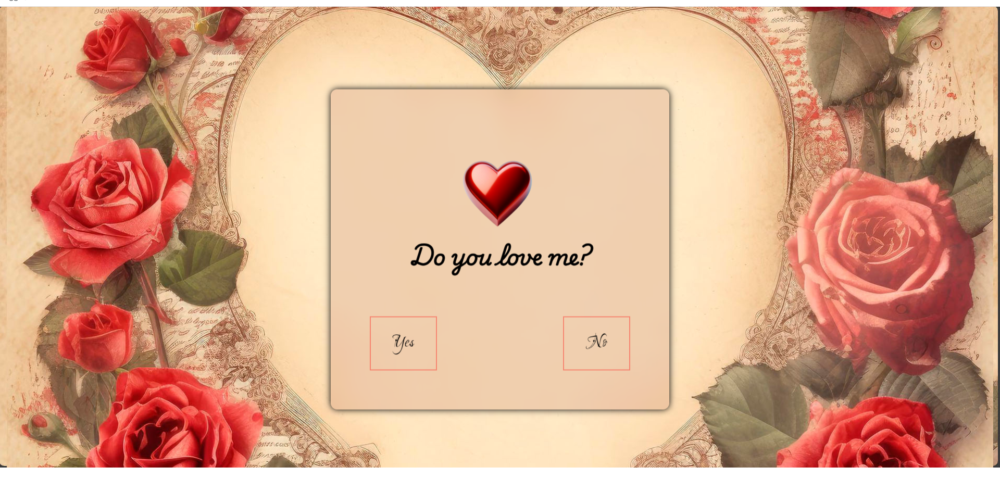
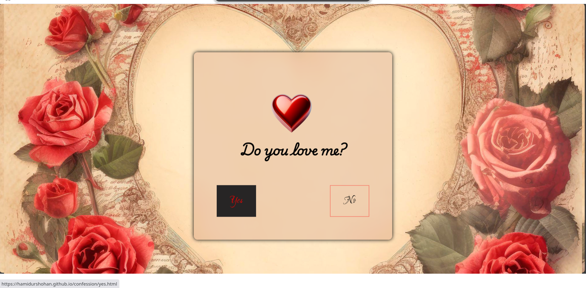
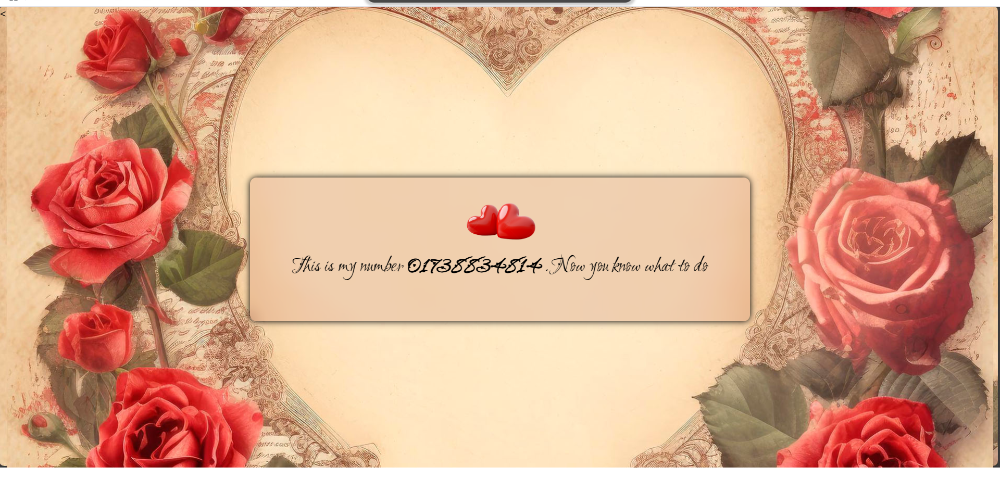
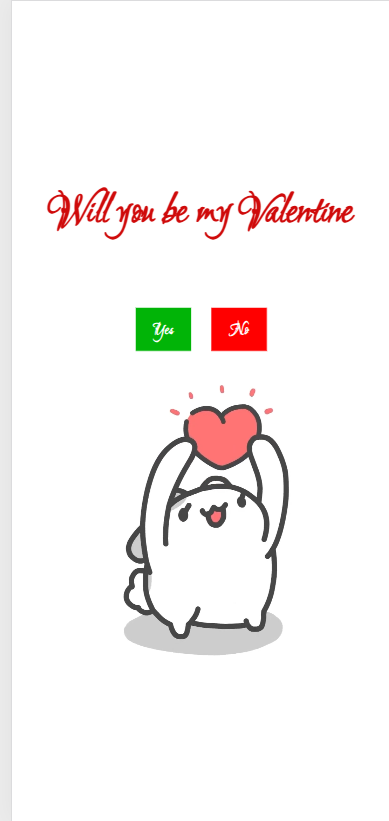
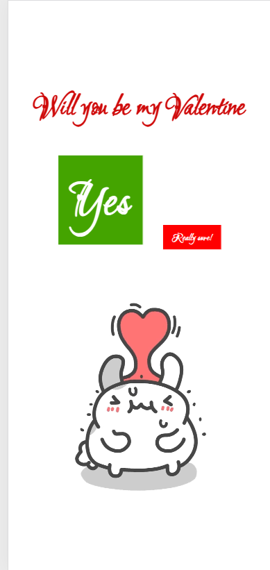
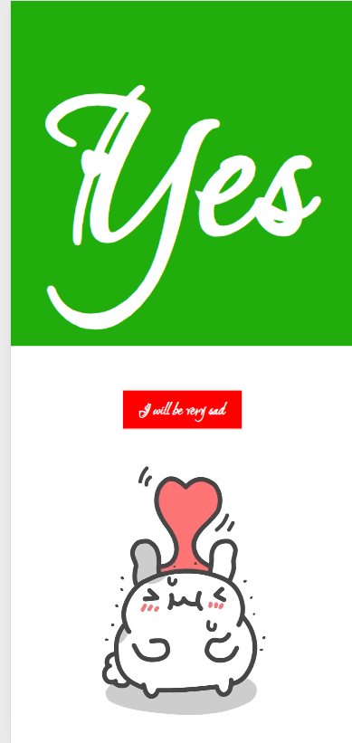
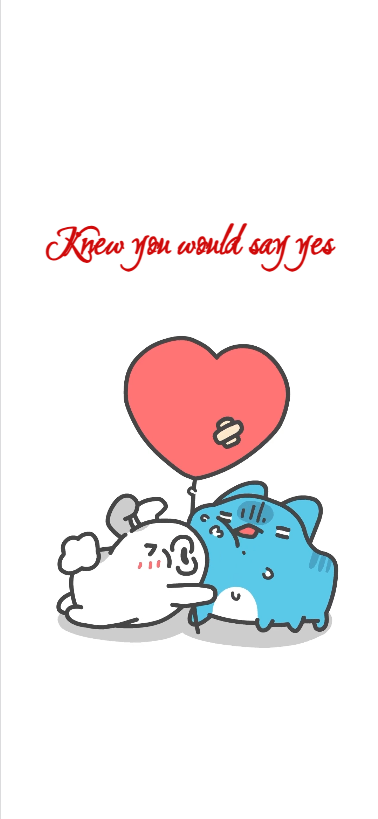

---

## Overview

A bunch of fun and quirky web projects made with just HTML and CSS and a little bit of JavaScript! These creations are all about experimenting with design and adding a little fun to the web.

---

## Project Images

  

  

  

    
    
    
    
    

---

## Website Links

- [Project 1](https://hamidur0x.github.io/confession/)
- [Project 2](https://hamidur0x.github.io/valentine/)

