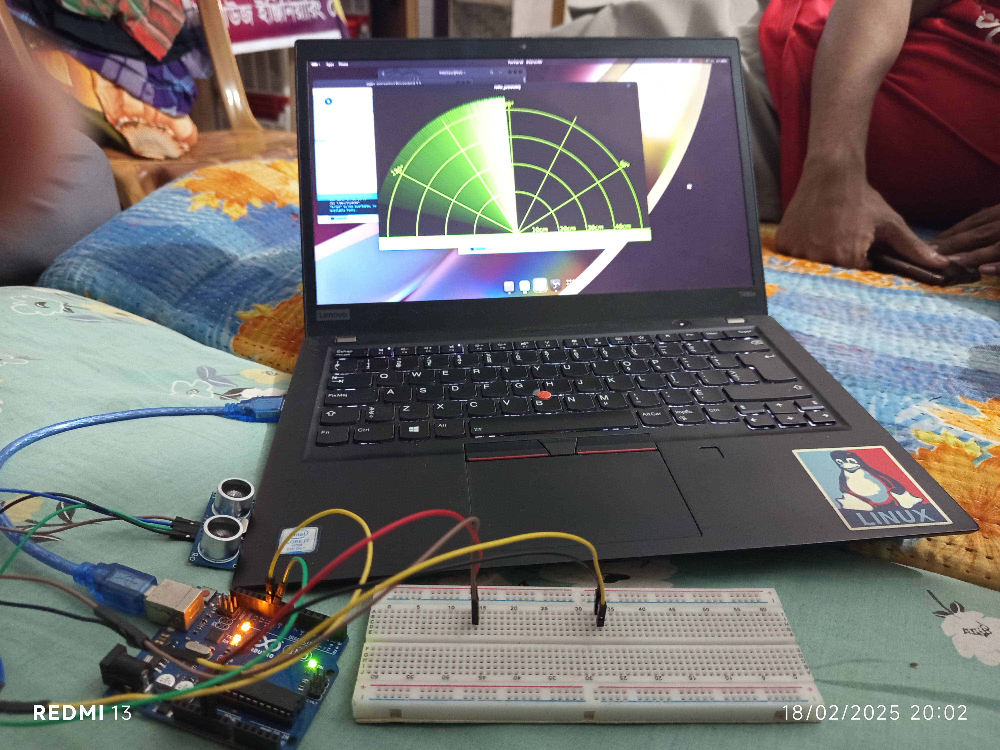

## Overview

This project involves creating a simple radar system using an ultrasonic sensor (HC-SR04), an Arduino Uno, and a servo motor. The ultrasonic sensor is mounted on the servo motor, which rotates to scan the surroundings. It measures distances by sending ultrasonic waves and detecting their reflections, mimicking real radar functionality.The Arduino processes the sensor data and sends it to a Processing program, which visually represents the detected objects on a radar-like interface. This allows real-time visualization of obstacles within a specific range

## Project Images

  

---

## Demonstration Video

<video controls width="600">
  <source src="3.mkv" type="video/mp4">

</video>

<video controls width="600">
  <source src="2.mp4" type="video/mp4">
    Real-Time Object Detection and Visualization
</video>
---