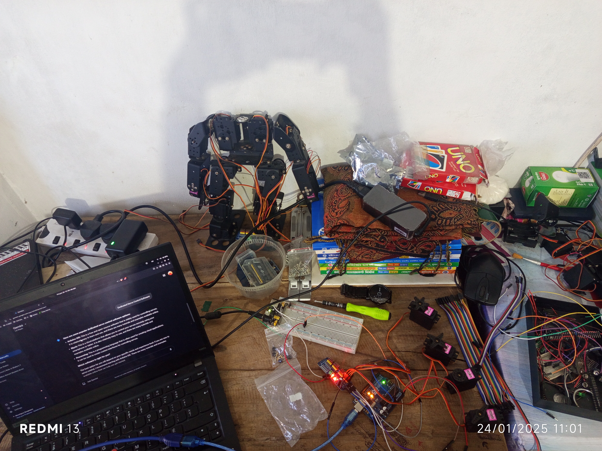
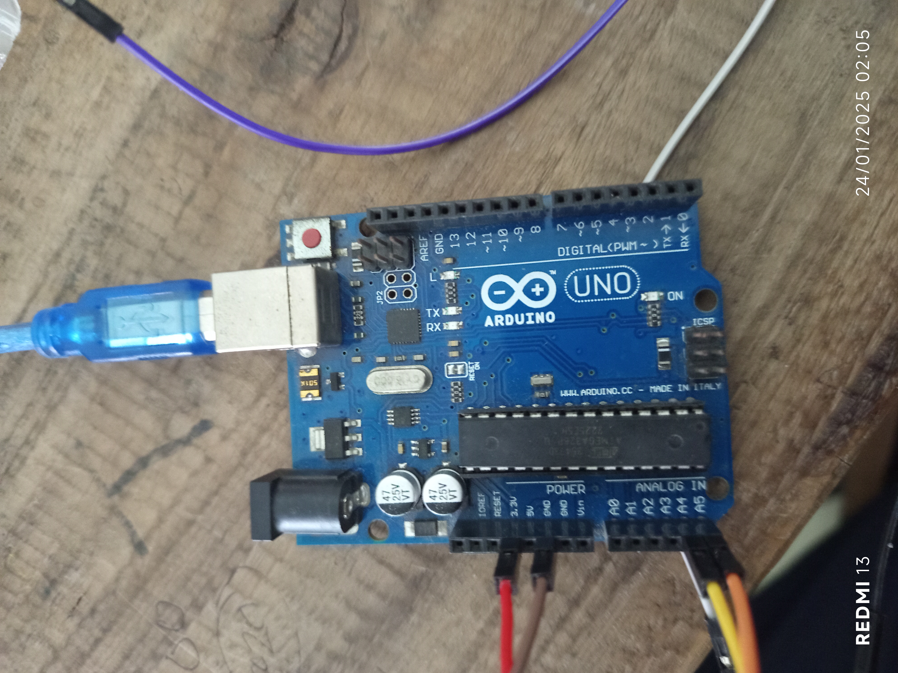
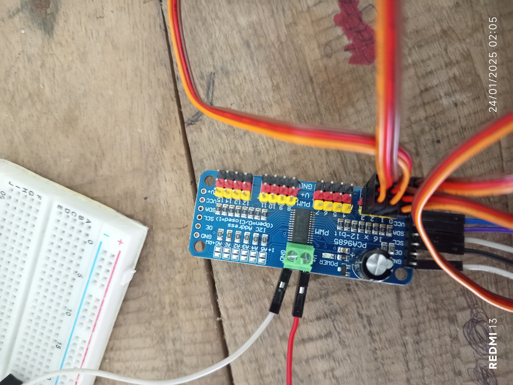

## Overview

This robot is controlled by an Arduino Uno and powered by multiple servo motors, which are managed using a PCA9685 16-Channel Servo Controller. The robot's movement is controlled through code, which is likely stored on a computer and executed via the Arduino. The servo motors are connected to the PCA9685 Servo Controller, which in turn is connected to the Arduino Uno. The servo motors receive power from an external source, such as a battery pack, ensuring they have sufficient energy to operate efficiently.

---

## Project Images

  

  

  

---

## Demonstration Videos

<video controls width="600">
  <source src="video1.mkv" type="video/mp4">
  Your browser does not support the video tag.
</video>

<video controls width="600">
  <source src="video2.mkv" type="video/mp4">
  Your browser does not support the video tag.
</video>

---
