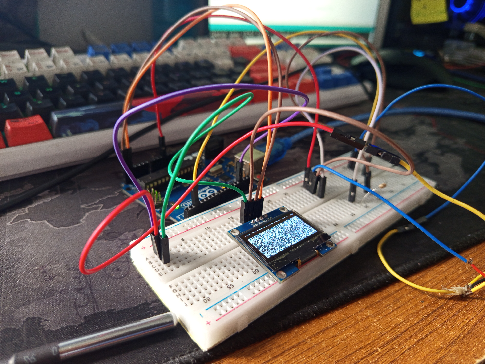

---

## Overview

This project is a water temperature meter built using an Arduino Uno, an OLED display, and a DS18B20 waterproof temperature sensor. The system accurately measures the water temperature and displays the real-time readings on the OLED screen. It’s ideal for applications like aquarium monitoring, water tanks, or DIY experiments, offering a simple and reliable way to track water temperature with digital precision.

---

## Project Images

  

  

---

## Demonstration Videos

<video controls width="600">
  <source src="1.mp4" type="video/mp4">
</video>

<video controls width="600">
  <source src="2.mp4" type="video/mp4">

</video>
---